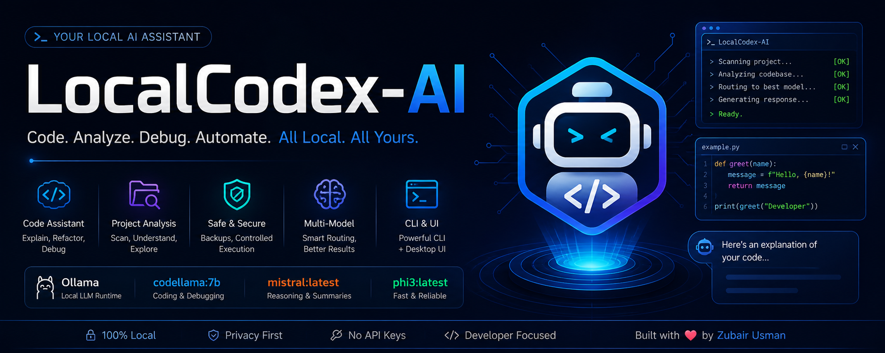

# LocalCodex-AI 🚀

LocalCodex-AI is a lightweight, local-first AI assistant designed to help with coding, project analysis, research, debugging, and safe file editing using Ollama-powered models.

This project acts as a personal AI command center, combining multiple local models with a modular agent system to simulate a small AI development team all running locally.

---

<p align="center">
  
</p>

## 🔹 Overview

**LocalCodex-AI is built to provide:**

- Code understanding and explanation
- Project structure analysis
- Safe file editing with backups
- Multi-model routing (coding, reasoning, fallback)
- CLI-based workflow automation
- Optional desktop interface (Tkinter)

It follows a **Codex-style workflow** while remaining lightweight and mostly offline.

---

## ⚙️ Tech Stack

- Python
- Ollama (local LLM runtime)
- Local Models (LLMs)
- Tkinter (UI)
- Requests
- Optional Open Interpreter integration

---

## 🤖 Models Used

The system uses multiple local models for different tasks:

- `codellama:7b` → coding, debugging, refactoring
- `mistral:latest` → architecture, summaries, reasoning
- `phi3:latest` → fast responses and fallback

---

## 🚀 Main Features

- 🔍 Project scanning and structure analysis
- 💻 Code explanation and refactoring
- 🛠 Safe file editing with backup system
- 🧠 Multi-model intelligent routing
- 📄 Documentation improvement
- 🧪 Debugging assistance
- 🧩 Modular agent-based architecture
- 🖥 CLI + optional desktop UI

---

## 🧭 How It Works

The system behaves like a small AI team:

- **Coder Model** → handles code edits and fixes
- **Reasoning Model** → explains, plans, summarizes
- **Fallback Model** → handles quick tasks
- **Agent System** → manages workflow and routing
- **Tools Layer** → safely executes actions

---

## 📦 Project Structure
## Project Structure

```text
codex_agent/
├── config.py        # Configuration management
├── providers.py     # Model providers
├── router.py        # Task classification and routing
├── project.py       # Project scanning and context handling
├── tools.py         # Safe execution layer
├── prompts.py       # Prompt templates
├── agent.py         # Core orchestration logic
└── cli.py           # Command-line interface

agent_config.json    # Runtime configuration
python run.py               # Main CLI entry point
python app.py               # Desktop UI (Tkinter)
```

---

## 🛠 Main Commands

### Ask questions about a project

``
python run.py ask "Explain controller.py" --project C:\Users\Administrator\AI_SYSTEM
``

## Scan project structure
``
python run.py scan --project
``
``
python run.py models
``
``
python run.py doctor
``
``
python run.py edit --file C:\path\to\file.py --instruction "Refactor for readability"
``
``
python app.py
``
## 🔐 Safety Features
- Command execution disabled by default
- File edits create automatic backups
- Open Interpreter disabled by default
- Controlled execution layer via tools system
- CLI and UI share same secure controlle

## 🧾 Legacy Support
- ai.py → older monolithic version (kept for reference)
- agents.py, controller.py, project_reader.py, memory.py, web_search.py
- → now act as compatibility wrappers for the modular system

## 📥 Installation

**Install dependencies:**
``
pip install -r requirements.txt
``
**Start Ollama:**
``
ollama serve
``
**Check installed models:**
``
ollama list
``

## 🎯 Use Cases
- Local AI coding assistant
- Code reviewer and debugger
- Documentation generator
- Research summarizer
- Automation tool builder
- Offline AI experimentation
- Personal developer command center

## 🚀 Future Improvements
- Better memory system (PROJECT_MEMORY)
- Research document indexing (RAG)
- SDLC workflow automation
- Test runner integration
- Git-aware change tracking
- Multi-agent roles (Dev, QA, Security, Research)
- UI improvements

## 👨‍💻 Author

## Zubair Usman

Cybersecurity enthusiast, Python developer, and AI workflow builder.

- [GitHub](https://github.com/TheZubairUsman) 
- [Facebook](https://www.facebook.com/TheZubairUsman/)
- [LinkedIn](https://www.linkedin.com/in/thezubairusman/)
- [X.com](https://x.com/TheZubairUsman)
